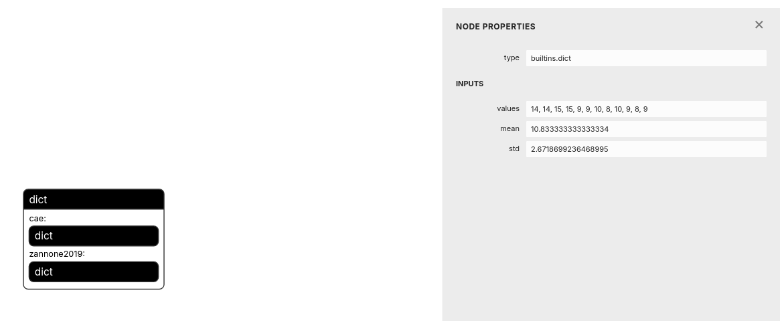

# AFA Benchmark

[](https://www.python.org/downloads/)
[]()
[]()
[]()

**A comprehensive benchmark for Active Feature Acquisition (AFA) methods**

Compare state-of-the-art algorithms for sequential feature selection in
scenarios where acquiring features is costly. Includes implementations of
multiple AFA methods, standardized datasets, and automated evaluation pipelines.

## Features

- Easily readable and reproducible configuration using
  [hydra](https://hydra.cc/).
- Modular design: rerun specific parts of the pipeline as needed.
- Extensible framework: add custom datasets and AFA methods.

## Limitations

- Currently supports only evaluation of _hard budget_ methods (methods with a
  fixed resource constraint).
- Supports only classification tasks; regression tasks are not yet implemented.

## What is Active Feature Acquisition?

**Active Feature Acquisition (AFA)** addresses scenarios where,

- **Features are expensive** to obtain (medical tests, surveys, sensors),
- **Real-time decisions** must be made with partial information,
- **Budget constraints** limit which features you can acquire.

**Example**: Medical diagnosis where each test costs money and time. AFA methods
intelligently decide which tests to order next based on previous results, aiming
for accurate diagnosis with minimal cost.

**Visual Example**

```
Patient arrives → Blood test → More tests needed?
     ↓              ↓              ↓
  Age: 45      Glucose: High    → AFA decides: Check HbA1c
  Sex: M       Pressure: Normal → Skip expensive MRI
               ↓
           Diagnosis with 3 tests instead of 10
```

## Installation

### Prerequisites

- [uv](https://docs.astral.sh/uv/)
- [Weights & Biases](https://wandb.ai) account (for experiment tracking)
- [mprocs](https://github.com/pvolok/mprocs) (optional, for batch training)

### Setup

```bash
# Clone repository
git clone https://github.com/Linusaronsson/AFA-Benchmark.git
cd AFA-Benchmark

# Install dependencies with uv
uv sync

# Setup W&B
uv run wandb login
```

Additionally, if you have access to a cluster running
[slurm](https://slurm.schedmd.com/), you might be interested in adding a
configuration file to the `conf/global/hydra/launcher/` directory. The name of
this file can then be referenced in scripts in order to run experiments in
parallel.

## Simple Example

Train and evaluate a single AFA method on synthetic data:

```bash
# 1. Generate synthetic dataset
uv run scripts/dataset_generation/generate_dataset.py \
  +dataset_type=cube \
  +output_artifact_aliases=[demo]

# 2. Train the MLP classifier
uv run scripts/train_classifiers/train_masked_mlp_classifier.py \
    dataset_artifact_name="cube_split_1:demo" \
    output_artifact_aliases=["latest"]

# 3. Train AACO method
uv run scripts/train_methods/train_aaco.py \
  dataset_artifact_name="cube_split_1:demo"

# 4. Evaluate performance
uv run scripts/evaluation/eval_afa_method.py \
  trained_method_artifact_name="aaco-cube_split_1:latest" \
  trained_classifier_artifact_name="null" \
  +budget=10 \
  dataset_split=testing \
  output_artifact_aliases=["demo"]

# 5. Create list of eval artifacts to list
echo -e "eval_artifact_names:\n  - aaco-cube_split_1-builtin:demo" > conf/plot/lists/demo.yaml

# 6. Plot results
uv run scripts/plotting/plot_results.py \
  eval_artifact_yaml_list="conf/plot/lists/demo.yaml"
```

**Expected output**: Plots showing accuracy vs. number of features acquired,
saved to W&B and locally.

## Implemented Methods

|    Method     |                                                                            Paper                                                                             |             Strategy             |  Greedy?   |
| :-----------: | :----------------------------------------------------------------------------------------------------------------------------------------------------------: | :------------------------------: | :--------: |
|  **EDDI-GG**  |                                                       [link](https://proceedings.mlr.press/v97/ma19c)                                                        |   Generative estimation of CMI   |   Greedy   |
|  **GDFS-DG**  |                                                     [link](https://proceedings.mlr.press/v202/covert23a)                                                     | Discriminative estimation of CMI |   Greedy   |
|  **DIME-DG**  |                                                           [link](https://arxiv.org/pdf/2306.03301)                                                           | Discriminative estimation of CMI |   Greedy   |
| **JAFA-MFRL** |                          [link](https://papers.nips.cc/paper_files/paper/2018/hash/e5841df2166dd424a57127423d276bbe-Abstract.html)                           |          Model-free RL           | Non-greedy |
|  **OL-MFRL**  |                                                           [link](https://arxiv.org/pdf/1901.00243)                                                           |          Model-free RL           | Non-greedy |
| **ODIN-MFRL** | [link](https://www.microsoft.com/en-us/research/publication/odin-optimal-discovery-of-high-value-information-using-model-based-deep-reinforcement-learning/) |          Model-free RL           | Non-greedy |
| **ODIN-MBRL** | [link](https://www.microsoft.com/en-us/research/publication/odin-optimal-discovery-of-high-value-information-using-model-based-deep-reinforcement-learning/) |          Model-based RL          | Non-greedy |
|   **AACO**    |                                                 [link](https://proceedings.mlr.press/v235/valancius24a.html)                                                 |           Oracle-based           | Non-greedy |
|   **PT-S**    |                                              [link](https://link.springer.com/article/10.1023/A:1010933404324)                                               |    Global feature importance     |    N/A     |
|   **CAE-S**   |                                                   [link](https://proceedings.mlr.press/v97/balin19a.html)                                                    |    Global feature importance     |    N/A     |

## Datasets

|     Dataset      |    Type    | Size (total, # data instances) | # Features | # Classes |
| :--------------: | :--------: | :----------------------------: | :--------: | :-------: |
|     **CUBE**     | Synthetic  |              1000              |     20     |     8     |
|  **AFAContext**  | Synthetic  |              1000              |     30     |     8     |
|    **MNIST**     | Real World |             60 000             |    784     |    10     |
| **FashionMNIST** | Real World |             60 000             |    784     |    10     |
|   **Diabetes**   | Real World |             92 063             |     45     |     3     |
|  **PhysioNet**   | Real World |             12 000             |     41     |     2     |
|  **MiniBooNE**   | Real World |            130 064             |     50     |     2     |

## Project structure

- `conf`: This is where all the configuration files are. Each configuration file
  corresponds to a class in `config_classes.py`.
- `docs`: Documentation.
- `scripts/`:
  - `dataset_generation/generate_dataset.py`: A script that generates datasets
    individually. Generates a dataset artifact.
  - `evaluation/eval_afa_method.py`: Evaluates a single method on a single
    dataset split. Generates an evaluation artifact.
  - `misc/calculate_evaluation_time.py`: Calculates the time it takes for a
    given method to be evaluated. Takes a list of plotting runs as input.
  - `misc/calculate_training_time.py`: Calculates the time it takes for a given
    method to be trained. Takes a list of plotting runs as input.
  - `misc/download_results_plot.py`: Downloads plots locally to your computer.
    Takes a plotting run as input.
  - `pipeline/`: Contains scripts that simplify batch training, i.e training a
    method on several datasets at the same time. You will need
    [mprocs](https://github.com/pvolok/mprocs) for these scripts.
    - `pretrain.py`: Batch pretrain a model.
    - `train.py`: Batch train a method.
    - `train_classifier.py`: Batch train a classifier.
  - `plotting/plot_results.py`: Plots results from a list of evaluation
    artifacts.
  - `pretrain_models`: Method-specific pretraining. Prefer
    `pipeline/pretrain.py` for batch pretraining.
  - `train_methods`: Method-specific training. Prefer `pipeline/train.py` for
    batch training.
- `src`: Source code.
- `tests`: Unit tests.

## Full Pipeline Tutorial

This tutorial will show how to train and evaluate two separate methods. The
first one, **ODIN**, is RL-based and has a pretraining stage. The second one,
**CAE**, is a static method based on global feature importance and does not
require pretraining. This will hopefully give you a good idea of how the
remaining methods are trained and evaluated as well.

We will only test run each script in the pipeline. We do this by adding
arguments such as `epochs=<SMALL_VALUE>`. You can remove these arguments if you
want to train and evaluate everything completely.

We will store all the runs and artifacts in a wandb project called
`afa-tutorial`. Set the environment variable `WANDB_PROJECT` equal to
`afa-tutorial` in the shell that you will use for the subsequent commands. In
bash and zsh (the most common shells on Unix), run
`export WANDB_PROJECT=afa-tutorial`.

Similarly, set `DEVICE` either to `cpu` or `cuda`, and `LAUNCHER` either to
`basic` (if you run everything locally in sequence) or the name of the
configuration file (without suffix) that you have created in
`conf/global/hydra/launcher/` if you plan to run everything on a cluster using
Slurm.

If you use the `zsh` shell, first run `setopt NO_NOMATCH` in your terminal so
that square brackets do not have to be escaped in all commands.

### Dataset generation

First, generate some data. You can choose hyperparameters by creating new
configurations in `conf/dataset_generation/dataset/`. Let's assume that you want
to generate two noiseless versions of the **cube** and **AFAContext** datasets.
Then run

```bash
uv run scripts/dataset_generation/generate_dataset.py -m hydra/launcher=basic dataset=AFAContext_without_noise,cube_without_noise split_idx=1,2 output_artifact_aliases=["tutorial-data"]
```

Note how the chosen alias `"tutorial-data"` will be used by subsequent scripts
that use these datasets.

### Pretraining

**ODIN** has a pretraining stage where a partial variational autoencoder (PVAE)
is trained. To pretrain on the recently generated datasets, run

```bash
uv run scripts/pipeline/pretrain.py --method-name "zannone2019" --dataset cube AFAContext --split 1 2 --launcher $LAUNCHER --device $DEVICE --dataset cube AFAContext --dataset-alias tutorial-data --output-alias tutorial-pretrained epochs=10
```

The **CAE** method does not have to be pretrained.

### Training

The training procedure is very similar to pretraining. The most notable
difference is that you now have to provide a set of hard budgets to use for each
dataset. To train **ODIN** and use the budgets [5,10] on **cube** but [4,8] on
**AFAContext**, you would run

```bash
uv run scripts/pipeline/train.py --method-name "zannone2019" --dataset cube AFAContext --budgets "5,10" "4,8" --split 1 2 --launcher $LAUNCHER --device $DEVICE --dataset cube AFAContext --pretrain-alias tutorial-pretrained --output-alias tutorial-trained n_batches=10 eval_only_n_samples=0
```

Since **CAE** does not have a pretraining stage, we supply dataset artifact
aliases instead of pretrained model aliases:

```bash
uv run scripts/pipeline/train.py --method-name "cae" --dataset cube AFAContext --budgets "5,10" "4,8" --split 1 2 --launcher $LAUNCHER --device $DEVICE --dataset cube AFAContext --dataset-alias tutorial-data --output-alias tutorial-trained
```

Note that training this static method is sufficiently fast, so there's no need
to limit the number of epochs.

### Classifier training

This is an optional step, but useful if you want to assess a method's feature
acquisition performance in isolation from a jointly trained classifier. Some
methods train a classifier jointly, but using such a classifier directly during
evaluation can make comparisons between methods difficult.

To train classifiers on our generated datasets, run:

```bash
uv run scripts/pipeline/train_classifier.py --dataset cube AFAContext --split 1 2 --launcher $LAUNCHER --device $DEVICE --dataset-alias tutorial-data --output-alias tutorial-classifier epochs=10
```

### Evaluation

One of the main features of **AFABench** is the consistent evaluation. The same
evaluation script is used for all methods. To evaluate the two methods we just
trained, we use the configuration file `conf/eval/lists/tutorial.yaml` in the
evaluation script:

```bash
uv run scripts/pipeline/evaluate.py --launcher $LAUNCHER --device $DEVICE --yaml conf/eval/lists/tutorial.yaml --output-alias tutorial-eval
```

### Plotting

Now we are ready to produce some plots. We need tell the plotting script which
evaluation results it should plot, so we create the file
`conf/plot/lists/tutorial.yaml`.

Now use it in the plotting script:

```bash
uv run scripts/plotting/plot_results.py eval_artifact_yaml_list=conf/plot/lists/tutorial.yaml
```

This will allow you to view the plots within the wandb run. They are also stored
as artifacts within the run, but can be burdensome to download by hand. Hence,
there is a script that downloads all the figures for you.

```bash
uv run scripts/misc/download_result_plots.py plotting_run_name=<PLOTTING_RUN_ID> datasets=["cube","AFAContext"] metrics=["accuracy_all","accuracy_all"] budgets=['.','.'] output_path=plot
```

where `<PLOTTING_RUN_ID>` is the ID of the plotting run ("9zsjrqn8" for
example).

This will download the figures to a local `plots/` directory.

The singular `'.'` instead of a list for budgets means that we accept any
budget.

### Miscellaneous

The `scripts/misc` contains other optional scripts that are not related to the
main AFA results.

There is a script for calculating the mean and standard deviation of both
training and evaluation time, for each method that a plotting run depends on.
Since some methods train a lot longer on some datasets, the standard deviation
can be quite large.

```bash
uv run scripts/misc/calculate_training_time.py plotting_run_names=["<PLOTTING_RUN_ID>"] output_artifact_aliases=["tutorial-training-time"]
```

```bash
uv run scripts/misc/calculate_evaluation_time.py plotting_run_names=["<PLOTTING_RUN_ID>"] output_artifact_aliases=["tutorial-evaluation-time"]
```

These runs will create artifacts with dictionaries containing the running times.
It will look like this:


## Adding New Components

You are highly recommended to use [hydra]() for specifying hyperparameters in
all of your scripts. The current code base makes heavy use of
[structured configs](https://hydra.cc/docs/tutorials/structured_config/intro/).
Place your dataclasses in `src/common/config_classes.py` and their corresponding
instantiations in `conf/`.

### New Dataset

1. **Implement dataset class**: All dataset classes are stored in
   `src/common/datasets.py`. They all implement the `AFADataset` protocol, which
   notably requires each dataset class to always have a fixed number of features
   and classes.

2. **Register**: To make other parts of the code become aware of the new
   dataset, add it to the registry. In `src/common/registry.py`,

- append an element to `AFA_DATASET_TYPES`
- add an additional `elif` statement to `get_afa_dataset_class`

3. **Add configuration** The configurations in
   `conf/dataset_generation/dataset/` specify which keyword arguments that
   should be used during data generation. You can refer to this file running the
   `generate_dataset.py` script.

### New AFA Method

1. **Implement the method**: You are free to place the source code for your
   method wherever you want. If you implement a new RL-based method, you could
   create the folder `src/afa_rl/new_rl_method/` for example. AFA methods are
   required to implement the `AFAMethod` protocol, which includes the `select`
   method for feature selection logic, and `predict` for classification logic.
   For methods that do not include a classifier, you can return uniform class
   probabilities in this method.

For an example of how to implement a trivial dummy method, see
`RandomDummyMethod` in `src/common/afa_methods.py`. For a slightly more
complicated example, check out `RLAFAMethod` in `src/afa_rl/afa_methods.py`
which is the class that all RL-based methods use.

2. **Register the method**: Modify `src/common/registry.py` by

- appending an element to `AFA_METHOD_TYPES`
- adding an additional `elif` statement to `get_afa_method_class`

## Citation

If you use this benchmark in your research, please cite,

```bibtex
@inproceedings{
}
```

## License

## Acknowledgments
